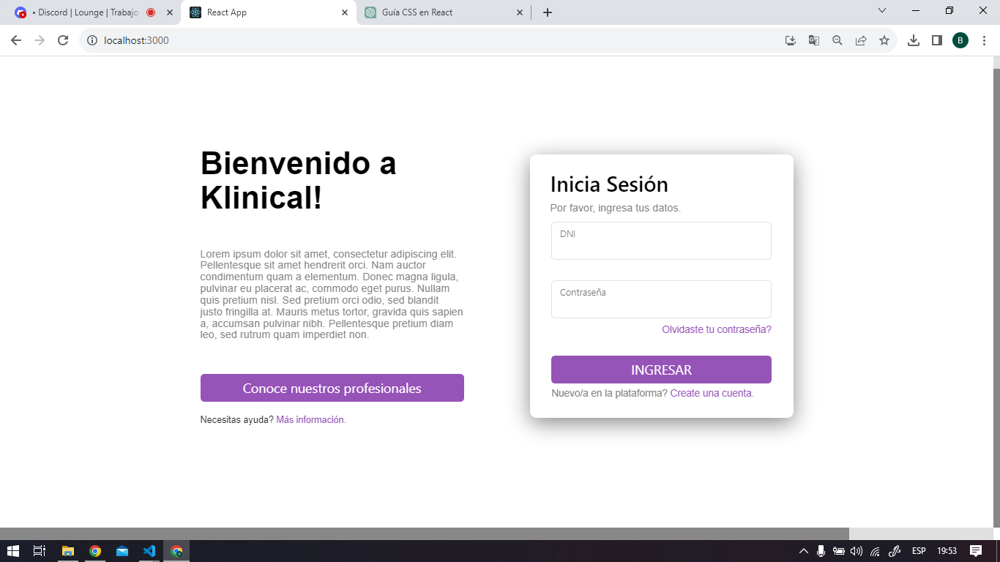
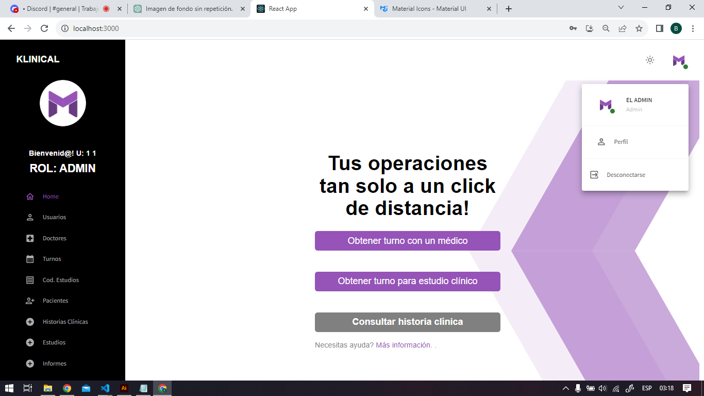
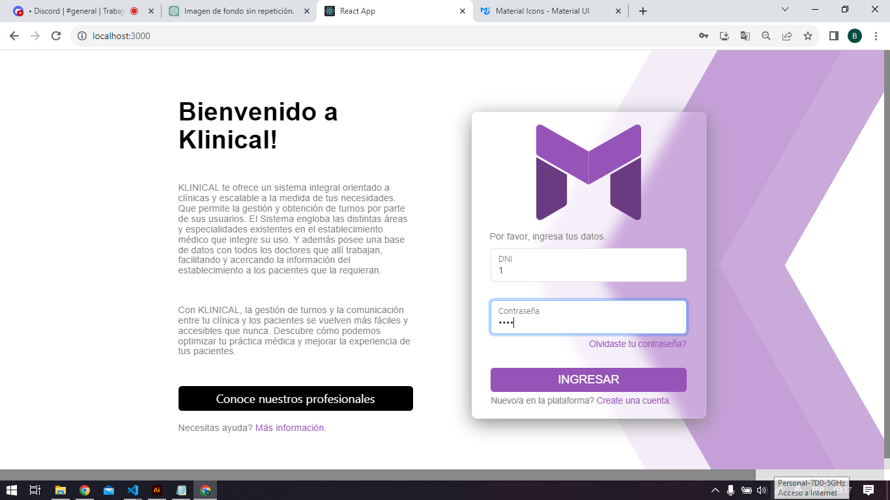

# 🔥🔥Trabajo_Final🔥🔥<!-- omit in toc -->

## 🔥🔥🔥Bienvenidos al Trabajo Final del Grupo 1.🔥🔥🔥

### Integrantes: Cena Emiliano,Maciel de Lima Marcos , Staudt Brenda, De Nigris Ignacio.

 

     

 
 

<!-- ALL-CONTRIBUTORS-BADGE:END -->

[]

# Tablas de contenido <!-- omit in toc -->

- [Instalación :inbox_tray::globe_with_meridians::wrench:](#Instalacion-inbox_tray-globe-with_meridians-wrench)
- [Hoja de Ruta :running:](#Hoja-de-Ruta-running)
- [Capturas del Proyecto](#Capturas-del-Proyecto)
- [Contribuidores :sparkles:](#Contribuidores-sparkles)
- [Licencia :scroll:](#Licencia-scroll)

---

## Instalación :inbox_tray::globe_with_meridians::wrench:

El archivo para inicializar la base de datos se encunetra en "database", con el nombre "database.sql". Hacerlo correr en su motor de base de datos.  

Para instalar el Backend necesita intalar Node.js, este proyecto esta desarrollado en la versión 18.16 del mismo. 
Una vez disponga de Node.js en su computadora, debera abrir la carpeta donde tiene el proyecto con su editor de código predilecto. 
De ser necesario, navegar desde la terminal del mismo hasta la carpeta apropiada e ingresar el comando "npm i" para instalar todas las dependencias del proyecto.
para inicializar el servidor ingrese el comando "nodemon index.js". 

PARA EL FRONTEND  
npm i 
npm start 

---

## Hoja de Ruta :running:

✅ Creamos el grupo 
✅ Creamos los githubs 
✅ Creamos el repositorio privado 
✅ Estructuramos las carpetas 
✅ Designamos una Hoja de ruta 
✅ Designamos Tareas 
✅ Subimos los archivos 
✅ Los reactualizamos con nuevos cambios 
✅ Debatimos cambios constantemente 
✅ Integramos nuevas tecnologias 
✅ Generamos un concenso  
✅ Realizamos los Merges en conjunto❤️ 
✅ Testeamos las funcionalidades 
✅ Corregimos los ultimos detalles ⚗️⚗️⚗️ 
✅ Presentamos el proyecto 

---

## Capturas del Proyecto

    

     

---

## Contribuidores :sparkles:

<!-- ALL-CONTRIBUTORS-LIST:START - Do not remove or modify this section -->
<!-- prettier-ignore-start -->
<!-- markdownlint-disable -->
<table>
  <tr>
    <td align="center"><a href="https://github.com/AlfredoDeNigris"> <b>Ignacio de Nigris</b></a> <a href="#ideas" title="Ideas, Planning, & Feedback">🤔</a> <a href="#Code" title="Code">💻</a> <a href="#Documentation" title="Documentation">📖</a> <a href="#bug-reports" title="Bug reports">🐛</a> <a href="#maintenance" title="Maintenance">🚧</a> <a href="#platform-IronTony" title="Packaging/porting to new platform">📦</a> <a href="#question-IronTony" title="Answering Questions">💬</a> <a href="#whattsapp" title="Reviewed Pull Requests">👀</a> <a href="#Test" title="Tests">⚠️</a> <a href="#example" title="Examples">💡</a></td>
    <td align="center"><a href="https://github.com/MarcosMaciel2"> <b>Maciel de Lima Marcos</b></a> <a href="#ideas" title="Ideas, Planning, & Feedback">🤔</a> <a href="#Code" title="Code">💻</a> <a href="#Documentation" title="Documentation">📖</a> <a href="#bug-reports" title="Bug reports">🐛</a> <a href="#maintenance" title="Maintenance">🚧</a> <a href="#platform-IronTony" title="Packaging/porting to new platform">📦</a> <a href="#question-IronTony" title="Answering Questions">💬</a> <a href="#whattsapp" title="Reviewed Pull Requests">👀</a> <a href="#Test" title="Tests">⚠️</a> <a href="#example" title="Examples">💡</a></td>
    <td align="center"><a href="https://github.com/EmiCena"> <b>Emi Cena</b></a> <a href="#ideas" title="Ideas, Planning, & Feedback">🤔</a> <a href="#Code" title="Code">💻</a> <a href="#Documentation" title="Documentation">📖</a> <a href="#bug-reports" title="Bug reports">🐛</a> <a href="#maintenance" title="Maintenance">🚧</a> <a href="#platform-IronTony" title="Packaging/porting to new platform">📦</a> <a href="#question-IronTony" title="Answering Questions">💬</a> <a href="#whattsapp" title="Reviewed Pull Requests">👀</a> <a href="#Test" title="Tests">⚠️</a> <a href="#example" title="Examples">💡</a></td>
    <td align="center"><a href="https://github.com/Sdt-Brenda"> <b>Brenda Staudt</b></a> <a href="#ideas" title="Ideas, Planning, & Feedback">🤔</a> <a href="#Code" title="Code">💻</a> <a href="#Documentation" title="Documentation">📖</a> <a href="#bug-reports" title="Bug reports">🐛</a> <a href="#maintenance" title="Maintenance">🚧</a> <a href="#platform-IronTony" title="Packaging/porting to new platform">📦</a> <a href="#question-IronTony" title="Answering Questions">💬</a> <a href="#whattsapp" title="Reviewed Pull Requests">👀</a> <a href="#Test" title="Tests">⚠️</a> <a href="#example" title="Examples">💡</a></td>
  </tr>
</table>

<!-- markdownlint-enable -->
<!-- prettier-ignore-end -->

<!-- ALL-CONTRIBUTORS-LIST:END -->

---

## Licencia :scroll:

Contamos con la licencia de nuestros padres para realizar este proyecto
